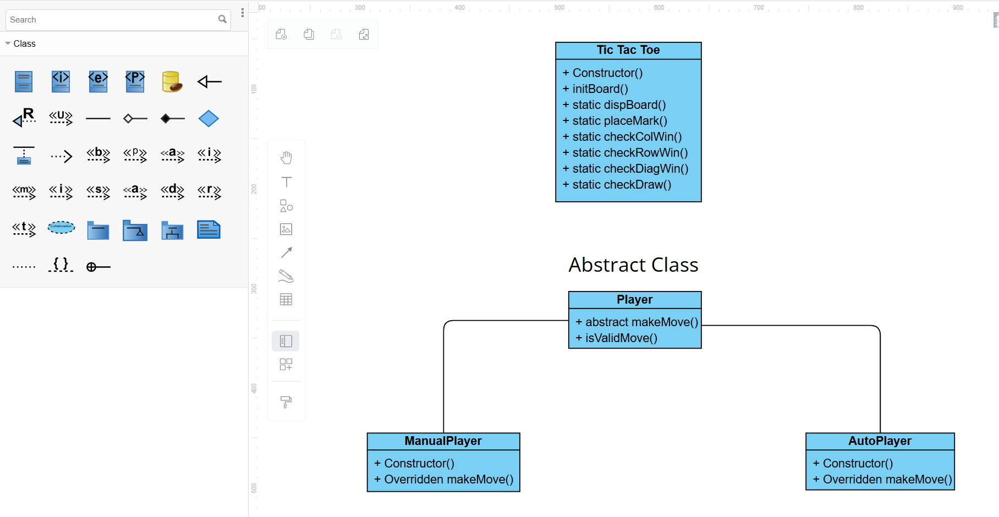

# Tic-Tac-Toe Console Game 🎮

A robust, object-oriented Tic-Tac-Toe game implementation in Java featuring both manual and automated player modes with comprehensive edge case handling.



## 📋 Table of Contents
- [Overview](#overview)
- [Features](#features)
- [Architecture](#architecture)
- [How It Works](#how-it-works)
- [Edge Cases Handled](#edge-cases-handled)
- [Getting Started](#getting-started)
- [Gameplay](#gameplay)
- [Technical Implementation](#technical-implementation)

## 🎯 Overview

This is a fully functional console-based Tic-Tac-Toe game built with Java, demonstrating solid object-oriented programming principles including inheritance, abstraction, and encapsulation. The game allows a human player to compete against an AI opponent with automatic move generation.

## ✨ Features

- **Human vs Computer gameplay** - Play against an intelligent AI opponent
- **Clean console interface** - Easy-to-read board display with grid formatting
- **Input validation** - Comprehensive checks for all user inputs
- **Automatic AI moves** - Computer player makes random valid moves
- **Win detection** - Checks rows, columns, and diagonals for victories
- **Draw detection** - Identifies when the board is full with no winner
- **Real-time feedback** - Displays board state after each move

## 🏗️ Architecture

The application follows a clean object-oriented design with four main classes:

### 1. **TicTacToe Class**
The game board manager that handles all game state and logic:
- Initializes and maintains the 3x3 game board
- Displays the board in a formatted grid
- Places marks on the board with position validation
- Implements win condition checking (rows, columns, diagonals)
- Detects draw conditions

### 2. **Player Abstract Class**
The base class defining common player behavior:
- Stores player name and mark (X or O)
- Defines abstract `makeMove()` method for polymorphic behavior
- Implements `isValidMove()` for move validation across all player types

### 3. **ManualPlayer Class**
Represents the human player:
- Extends `Player` abstract class
- Accepts row and column input from the user
- Validates moves before placement
- Loops until a valid move is entered

### 4. **AutoPlayer Class**
Represents the computer opponent:
- Extends `Player` abstract class
- Generates random valid moves
- Uses `Random` class for move generation
- Ensures only valid positions are selected

### 5. **LaunchGame Class**
The main entry point that orchestrates gameplay:
- Creates game instance and players
- Manages turn alternation
- Checks win/draw conditions after each move
- Displays game results

## 🎮 How It Works

The game follows this flow:

1. **Initialization**: Creates a new game board and two players (Manual and Auto)
2. **Turn Loop**: Alternates between players until game ends
3. **Move Making**: Current player makes a move (validated automatically)
4. **Board Update**: Display updated board state
5. **Condition Check**: Verify if there's a winner or draw
6. **Result**: Announce winner or draw, then exit

## 🛡️ Edge Cases Handled

This implementation carefully handles numerous edge cases to ensure robust gameplay:

### 1. **Invalid Position Input**
- **Issue**: User enters row/column outside 0-2 range
- **Solution**: `isValidMove()` validates coordinates are within bounds before accepting
- **Code**: Checks `(row >= 0 && row <= 2) && (col >= 0 && col <= 2)`

### 2. **Occupied Cell Selection**
- **Issue**: Player tries to place mark in already occupied cell
- **Solution**: `isValidMove()` checks if cell contains a space character
- **Code**: Verifies `TicTacToe.board[row][col] == ' '`
- **Behavior**: Loops until valid position is chosen

### 3. **Invalid Input Type**
- **Issue**: User enters non-integer input
- **Solution**: Scanner's `nextInt()` naturally handles type checking
- **Behavior**: Game will prompt for re-entry (handled by Java runtime)

### 4. **Multiple Win Conditions**
- **Issue**: Need to check all possible win scenarios
- **Solution**: Separate methods for each win type
  - `checkRowWin()`: Validates all three rows
  - `checkColWin()`: Validates all three columns
  - `checkDiagWin()`: Validates both diagonals (top-left to bottom-right and top-right to bottom-left)

### 5. **Draw Detection**
- **Issue**: Board full but no winner
- **Solution**: `checkDraw()` iterates through entire board
- **Logic**: Only returns false if any empty space exists
- **Prevents**: Infinite loops when board is full

### 6. **Empty Cell Win Prevention**
- **Issue**: False win detection with empty cells
- **Solution**: All win methods check `board[i][j] != ' '` first
- **Ensures**: Only actual marks can form winning combinations

### 7. **AI Invalid Move Prevention**
- **Issue**: Computer might select occupied cells randomly
- **Solution**: `do-while` loop continues generating positions until valid
- **Code**: `while (!isValidMove(row, col))`
- **Result**: AI never makes illegal moves

### 8. **Turn Management**
- **Issue**: Ensuring proper alternation between players
- **Solution**: Toggle current player after each valid move
- **Logic**: `cp = (cp == p1) ? p2 : p1`

### 9. **Game State Consistency**
- **Issue**: Board state must match actual game progress
- **Solution**: Static board ensures single source of truth
- **Benefit**: All methods operate on same board instance

### 10. **Premature Game End Prevention**
- **Issue**: Game should only end on win or draw
- **Solution**: Win/draw checks only occur after valid moves
- **Flow**: Move → Display → Check → Continue or End

## 🚀 Getting Started

### Prerequisites
- Java Development Kit (JDK) 8 or higher
- Command line or terminal access

### Installation

1. Clone the repository:
```bash
git clone https://github.com/PranavbalajiGit/TIC-TAC-TOE-Console-Application---Java.git
cd TIC-TAC-TOE-Console-Application---Java
```

2. Compile the Java file:
```bash
javac LaunchGame.java
```

3. Run the game:
```bash
java LaunchGame
```

## 🎲 Gameplay

### Game Rules
- The board is a 3x3 grid numbered from 0 to 2 for both rows and columns
- Player 1 (Pranav) uses 'X' mark
- Player 2 (Computer) uses 'O' mark
- Players alternate turns
- First to get three marks in a row (horizontal, vertical, or diagonal) wins
- If the board fills with no winner, the game is a draw

### Input Format
When prompted, enter two numbers separated by space:
```
Enter the Row and Column : 0 1
```
This places your mark at row 0, column 1 (top-middle position).

### Board Layout
```
-------------
|   |   |   |
-------------
|   |   |   |
-------------
|   |   |   |
-------------
```

Position reference:
- (0,0) = Top-left
- (0,1) = Top-middle
- (0,2) = Top-right
- (1,0) = Middle-left
- (1,1) = Center
- (1,2) = Middle-right
- (2,0) = Bottom-left
- (2,1) = Bottom-middle
- (2,2) = Bottom-right

## 💻 Technical Implementation

### Key Design Patterns Used

1. **Abstraction**: `Player` abstract class defines contract for all player types
2. **Inheritance**: `ManualPlayer` and `AutoPlayer` extend base `Player` class
3. **Polymorphism**: Both player types can be referenced as `Player` type
4. **Encapsulation**: Board state managed internally by `TicTacToe` class
5. **Static Members**: Board is static, allowing all methods to access shared state

### Code Quality Features

- **Clear method names**: Self-documenting code with descriptive method names
- **Single Responsibility**: Each method handles one specific task
- **Input validation**: Multiple layers of validation prevent invalid states
- **Separation of Concerns**: Game logic, display, and player actions are separate
- **Extensibility**: Easy to add new player types by extending `Player` class

### Potential Enhancements

- Add difficulty levels for AI (easy, medium, hard)
- Implement minimax algorithm for unbeatable AI
- Add score tracking across multiple games
- Create GUI version using Swing or JavaFX
- Add player vs player mode
- Implement save/load game functionality
- Add undo/redo move capability

## 📝 License

This project is open source and available under the MIT License.

## 👤 Author

**PRANAV BALAJI P MA - Tech Enthusiast**

Feel free to contribute, report issues, or suggest improvements!

---
